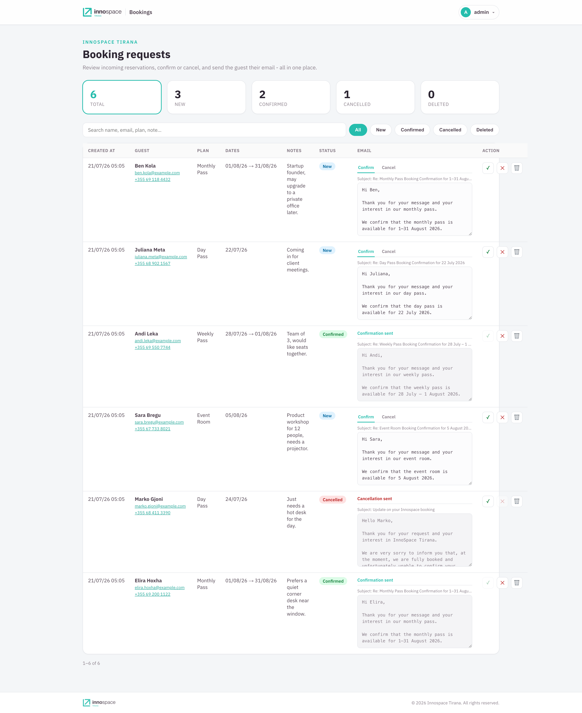
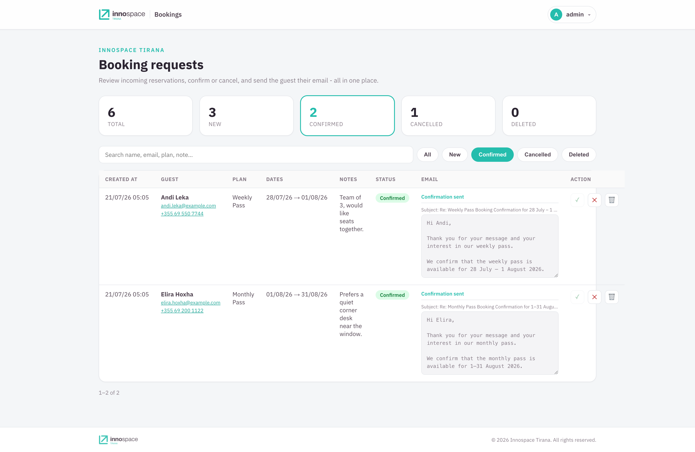
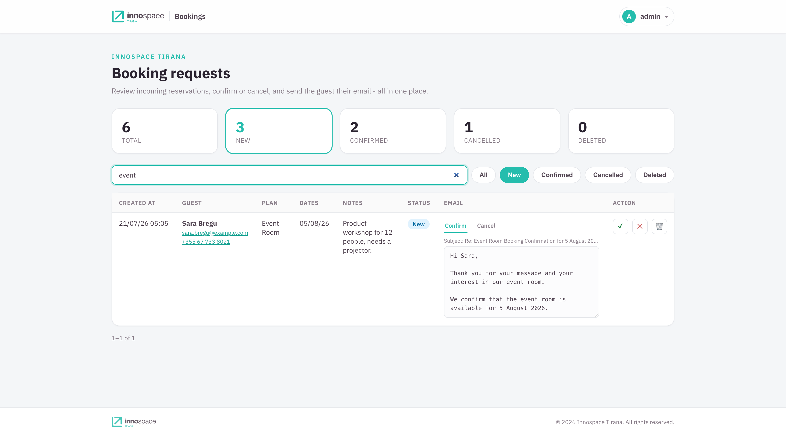
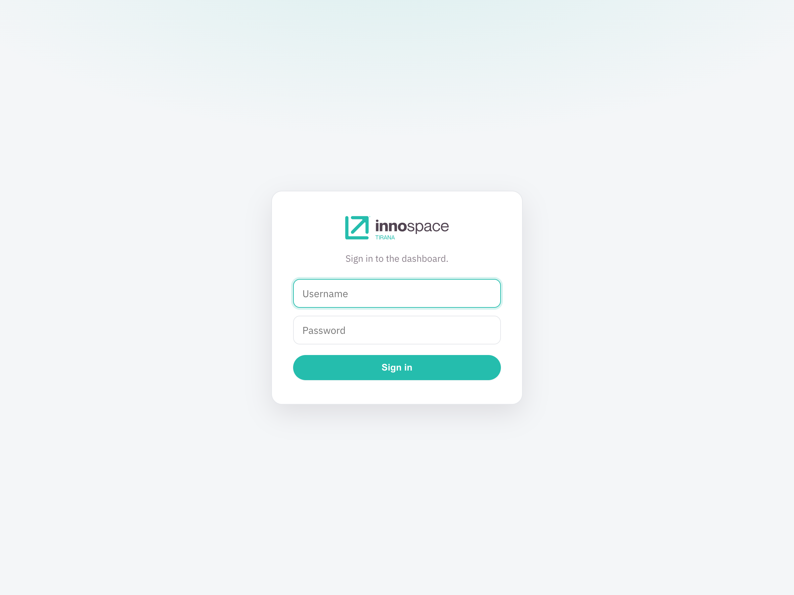
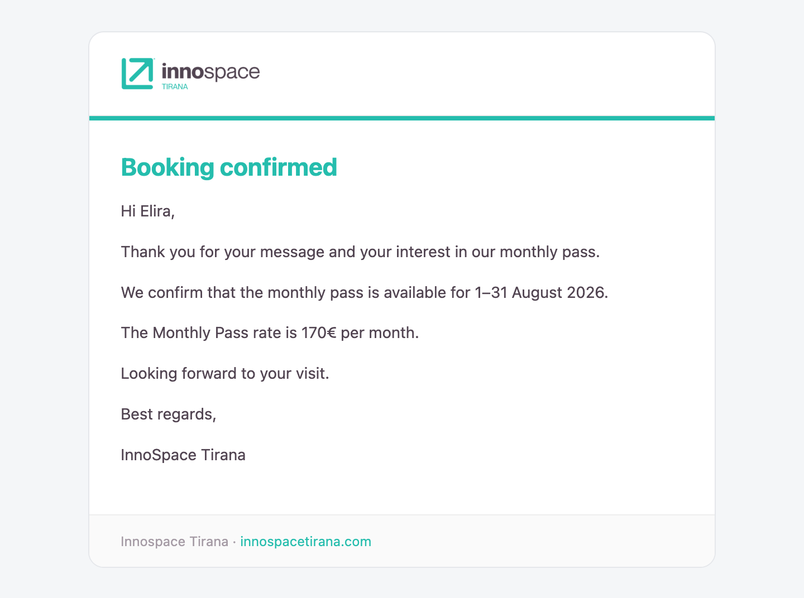

# Innospace Bookings

A small **Next.js microservice** that replaces Formspark for the Innospace Tirana
booking form. It:

1. **Receives** booking submissions (`POST /api/bookings`).
2. **Stores** them in a **SQLite** database (`data/bookings.db`).
3. **Shows a dashboard** (`/dashboard`, login-protected) to browse, search, and
   confirm/cancel bookings.
4. **Emails** the customer a branded confirm/cancel notice (via
   [Resend](https://resend.com)) when you action a booking.

- **Repo:** <https://github.com/IgliHoxha/innospace-bookings>
- **Stack:** Next.js 15 (App Router) · React 19 · TypeScript · better-sqlite3 · Resend
- **Hosting:** Fly.io (Docker) behind `booking.innospacetirana.com`

<p align="center">
  
</p>

Filter by status (the counters double as filters) or search across name,
email, plan, and note:

<p align="center">
  
</p>

<p align="center">
  
</p>

---

## Quick start (local)

```bash
cp .env.example .env          # fill in values (see below)
npm install
npm run dev                   # http://localhost:4000
```

Or with Docker (matches production):

```bash
docker compose up -d --build  # http://localhost:4000
```

- Dashboard: <http://localhost:4000/dashboard>
- API: `POST http://localhost:4000/api/bookings`

### Scripts

| Command | Does |
| --- | --- |
| `npm run dev` / `start` | Dev / production server on port 4000. |
| `npm run build` | Production build. |
| `npm run lint` / `format` | ESLint / Prettier. |
| `npm run typecheck` | TypeScript check. |
| `make fmt` / `make check` | Format+fix / CI-style verify. |

---

## Environment variables (`.env`)

All access goes through [`src/lib/env-app.ts`](src/lib/env-app.ts). **Required**
vars have no code fallback: the app throws on first use when one is missing, so a
misconfigured deploy fails loudly instead of silently running on a default.

| Var | Required | Purpose |
| --- | --- | --- |
| `RESEND_API_KEY` | no | Resend API key. If empty, emails are skipped (bookings still stored). |
| `EMAIL_FROM` | yes | Verified Resend sender (e.g. `bookings@innospacetirana.com`). |
| `APP_BASE_URL` | no | Base URL for links/logo in emails. Defaults to the production host. |
| `DASHBOARD_USERNAME` / `DASHBOARD_PASSWORD` | yes | Dashboard sign-in credentials. |
| `AUTH_SECRET` | yes | Long random string signing the login cookie (`openssl rand -hex 32`). |
| `ALLOWED_ORIGINS` | no | Comma-separated origins allowed to POST and to call mutating routes. Unset means any. |
| `TURNSTILE_SECRET_KEY` | no | Cloudflare Turnstile secret. If empty, verification is skipped. |
| `DATA_FILE` | no | SQLite path. Defaults to `./data/bookings.db`. |
| `PRICE_CURRENCY` | yes | Currency symbol used in every rate line. |
| `PRICE_*` (amounts) | no | Pricing packages surfaced in confirmation emails; an unpriced plan omits its rate line. |
| `LOGIN_MAX_ATTEMPTS` | yes | Failed logins per IP before a lockout. |
| `LOGIN_BLOCK_SECONDS` | yes | Base lockout duration in seconds; escalates xN per lockout. |
| `LOGIN_MAX_LOCKOUTS` | yes | Lockouts before an IP is banned outright. |
| `BUSINESS_NAME` | yes | Org name that signs off every email. |
| `BUSINESS_WEBSITE_URL` | no | Footer link. Defaults to `https://innospacetirana.com`. |
| `EMAIL_SIGNOFF_NAME`, other `BUSINESS_*` | no | Contact / access lines; each is omitted from the footer when blank. |

> **Login brute-force protection** is in-memory per-process (see
> [`src/lib/rate-limit.ts`](src/lib/rate-limit.ts)): after `LOGIN_MAX_ATTEMPTS`
> failures an IP is locked out for `LOGIN_BLOCK_SECONDS`, each further lockout
> lasting longer, and after `LOGIN_MAX_LOCKOUTS` lockouts the IP is banned until
> the process restarts. State is not shared across machines or persisted across
> restarts: fine for a single Fly machine.

---

## Data & auth

- **SQLite** (`better-sqlite3`): one `bookings` table in a single file on a
  persistent disk, WAL mode. The schema is applied by an ordered migration list
  in [`src/lib/db.ts`](src/lib/db.ts) keyed on `PRAGMA user_version`; to change
  it, append a new entry rather than editing a shipped one.
- **Login** is verified against `DASHBOARD_USERNAME` / `DASHBOARD_PASSWORD` in
  constant time, then a session is minted as an HMAC-signed, httpOnly cookie.
- The DB must live on a **persistent disk** (Fly volume / VPS disk), not a
  serverless filesystem.

The dashboard sits behind a branded sign-in (rate-limited per IP):

<p align="center">
  
</p>

---

## API

- `POST /api/bookings`: public; the website posts a booking here (origin-gated to
  `ALLOWED_ORIGINS`, honeypot + Turnstile). `201` on success.
- `GET /api/bookings`: protected; a filtered, searchable, paginated page.
- `DELETE /api/bookings`: protected; permanently removes soft-deleted rows.
- `PATCH /api/bookings/:id`: protected; `{ status, emailBody? }`. On
  confirm/cancel, emails the customer (uses `emailBody` if provided).
- `POST` / `DELETE /api/login`: sign in (sets cookie) / sign out.

Every state-changing handler runs `requireAllowedOrigin` first (CSRF defense in
depth alongside the `sameSite=lax` cookie), then the session guard in
[`src/lib/api-auth.ts`](src/lib/api-auth.ts).

---

## Email templates

`src/lib/templates.ts` holds the confirm/cancel bodies (shared by the mailer and
the dashboard preview, so the preview matches what's sent). Each booking row in
the dashboard has an editable Confirm/Cancel email; your edits are sent verbatim.

The customer receives a branded message (the confirmation for a monthly pass):

<p align="center">
  
</p>

---

## Deploy (Fly.io)

[`fly.toml`](fly.toml) holds **only non-sensitive infrastructure**: Docker
image, the volume at `/app/data`, the HTTP service, and VM size. It has **no
`[env]` block**: every runtime variable (credentials, API keys, origins, paths,
pricing, and the login-throttle thresholds) is stored as an **encrypted Fly
secret** via `fly secrets set`, so nothing environment-specific or sensitive is
committed. `.env.example` is the human-readable catalogue of every var.

```bash
fly launch --copy-config --no-deploy   # first time only
fly volumes create bookings_data --region fra --size 1

# All runtime config is a secret. Set them once (repeat for every var in .env.example):
fly secrets set \
  RESEND_API_KEY=re_xxx EMAIL_FROM='bookings@innospacetirana.com' \
  DASHBOARD_USERNAME='admin' DASHBOARD_PASSWORD='…' \
  AUTH_SECRET="$(openssl rand -hex 32)" \
  ALLOWED_ORIGINS='https://innospacetirana.com,https://www.innospacetirana.com' \
  DATA_FILE='/app/data/bookings.db' NODE_ENV='production' PORT='4000' HOSTNAME='0.0.0.0' \
  LOGIN_MAX_ATTEMPTS='5' LOGIN_BLOCK_SECONDS='60' LOGIN_MAX_LOCKOUTS='10' \
  PRICE_CURRENCY='€' PRICE_DAILY_PASS='15' PRICE_WEEKLY_PASS='60' PRICE_MONTHLY_PASS='170' \
  PRICE_EVENT_ROOM_HOUR='25' PRICE_EVENT_ROOM_DAY='170' \
  BUSINESS_NAME='InnoSpace Tirana'

fly deploy
fly certs add booking.innospacetirana.com
```

> To read or change a value later, use `fly secrets list` (names only) and
> `fly secrets set KEY=value` (triggers a rolling restart). Editing a secret is
> the only way to change config: there is no plaintext `[env]` to edit.

Then a Cloudflare `CNAME booking → <app>.fly.dev`. Pushing to `master` also
auto-deploys via GitHub Actions ([.github/workflows/fly-deploy.yml](.github/workflows/fly-deploy.yml)).

> Any Docker host with a persistent volume works too: `docker compose up -d --build`.

---

## Website integration

`_pages/booking.html` posts to `https://booking.innospacetirana.com/api/bookings`
and `assets/js/main.js` sends the structured fields. Rebuild/redeploy the Jekyll
site after changing them.

---

## Backups

The whole DB is one file. Copy it off the volume:

```bash
docker compose cp bookings:/app/data/bookings.db ./backup.db
# or on Fly:  fly ssh sftp get /app/data/bookings.db ./backup.db
```

---

## Project layout

```
src/
  app/
    api/bookings/route.ts        POST (create), GET (list)
    api/bookings/[id]/route.ts   PATCH (status + customer email)
    api/login/route.ts           login / logout
    dashboard/                   protected dashboard
    login/                       login page
  lib/
    db.ts        SQLite storage + users/auth
    email.ts     Resend customer emails
    templates.ts email bodies + pricing (shared with the UI)
    auth.ts      cookie session
    cors.ts · types.ts
data/bookings.db                 the database (git-ignored)
Dockerfile · docker-compose.yml · fly.toml
```
